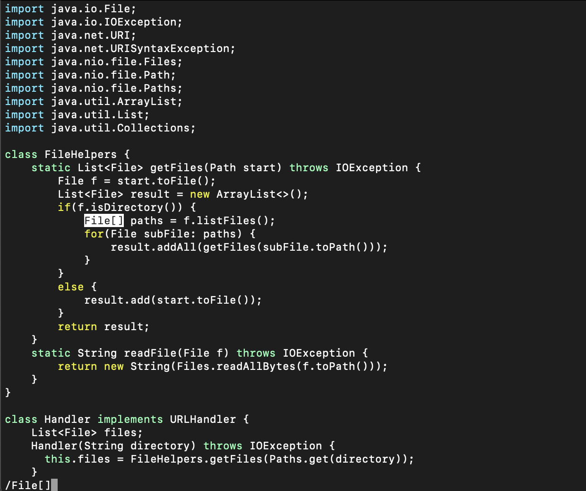
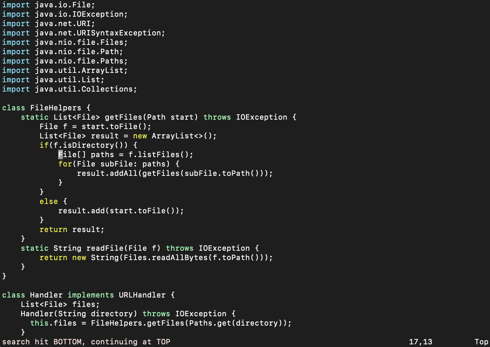
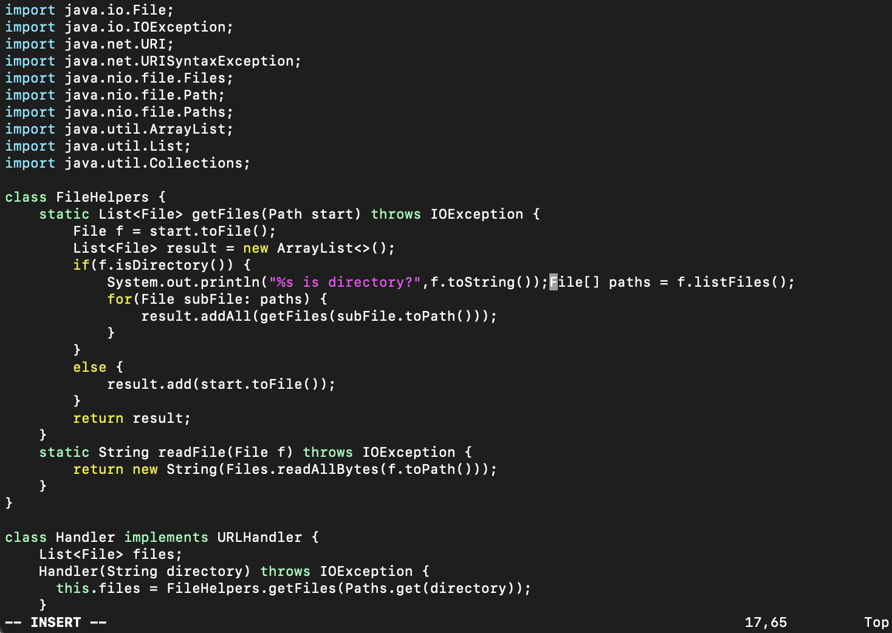
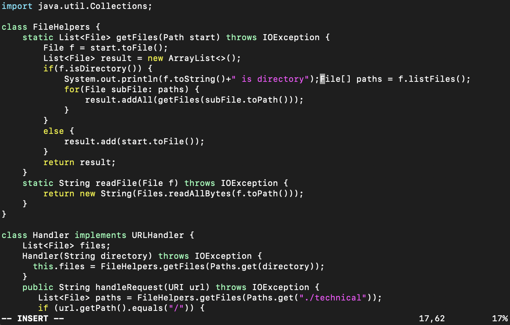
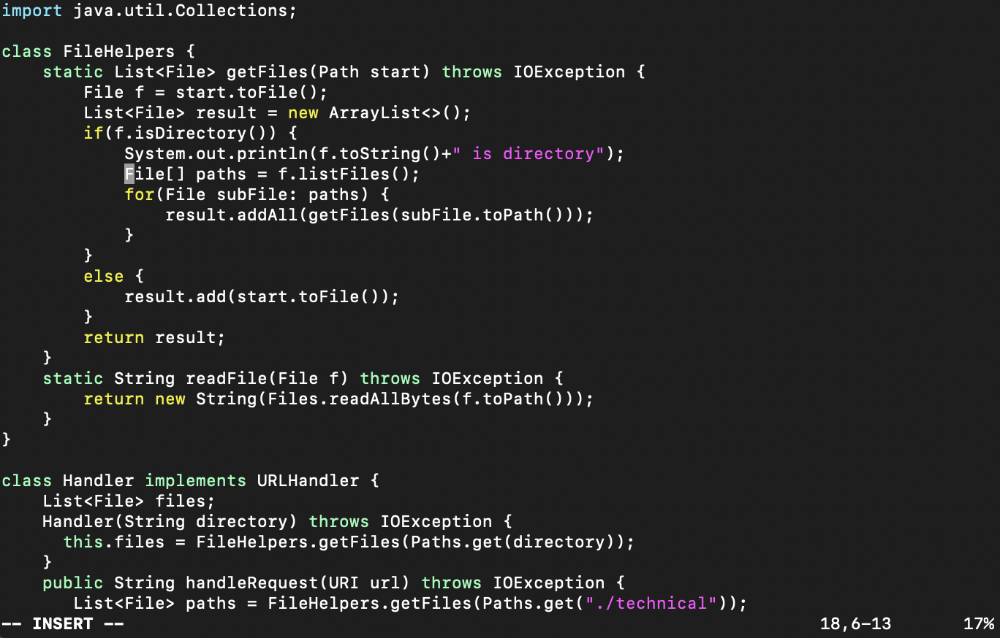
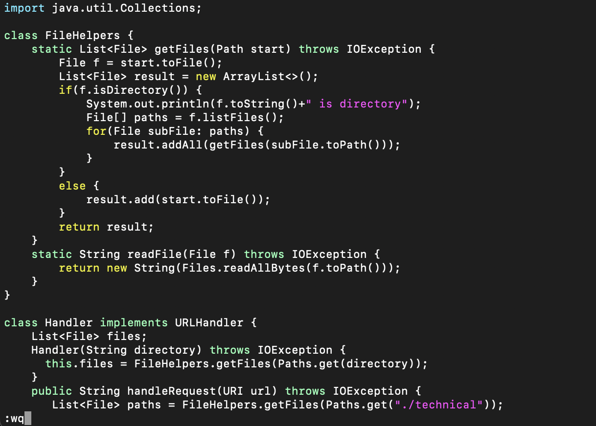
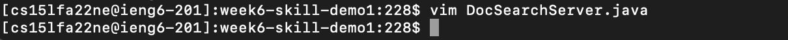

# Lab Report 4 - Vim
### 11/13/22
### Gunju Kim
## Part 1. 
### /File[]iSystem.out.println(f.toString()+" is directory”);<\Enter><\esc>:wq<\Enter>

> ###  1. Use backslash, "/", in order to search for the term, "File[]", which is the line where we want to insert new line.
### 
> ###  2. After pressing <\Enter>, the cursor is brought to the beginning of the line.
### 
> ###  3. Then press i in order to change to insert mode. In the lower left side of the screen, the word, "insert", is shown.
### 
> ###  4. Then type "System.out.println(f.toString()+" is directory”);".
### 
> ###  5. Press <\Enter> to separate two lines.
### 
> ###  6. Press <\esc> to turn off the insert mode and save the file and quit by typing <\shift>:wq.
### 
### 
# *************************************************************************
## Part 2. 
### 
### 
### - For the first trial of trying the first style, it took some time for me to remember how to copy the whole directory to the remote server. In order to copy the whole directory, I had to use scp -r directoryname cs15lfa22ne@ieng6.ucsd.edu. In the second trial, I could save some time by copy and pasting the command I used before.
### 
### 
### - For the first trial of trying the second style, I could save much more time than when I used the first style. By using vim in the remote server directly, I didn't have to spend time in opening and closing Visual Studiio Code.
### Among these two styles, I would prefer using the second style if I have to worko n a program that I run remotely. I can save some time by directly opening and fixing the file using vim. 
### If I have to constantly switch from one java file to another to compare or connect, it would be easier to use Visual Code because I can open multiple screen at one time. For the projects that I have to fix multiple java files at the same time, first style would be a better choice.

